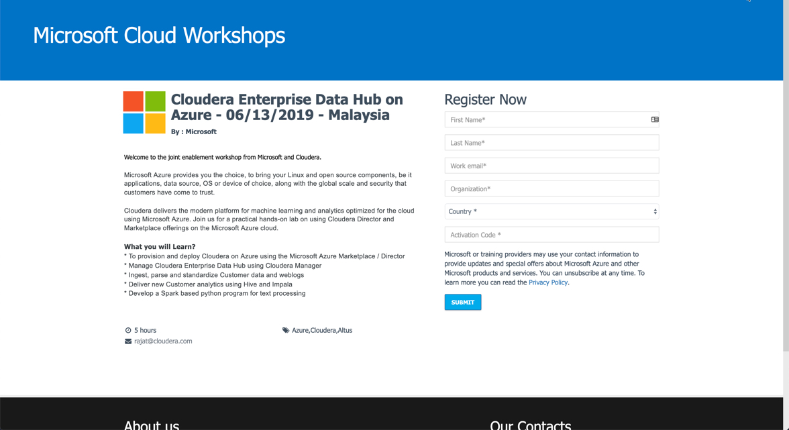
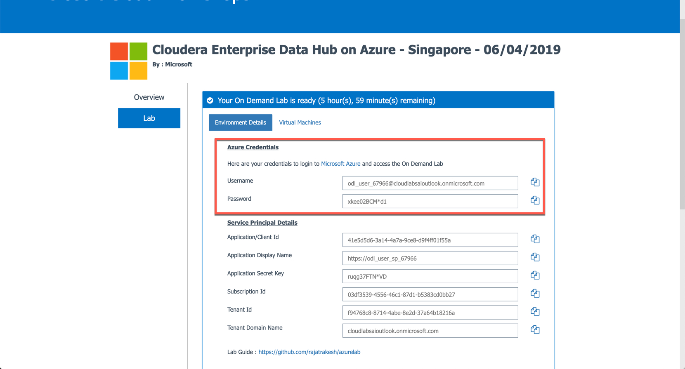
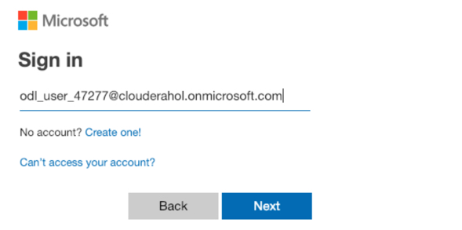
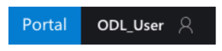
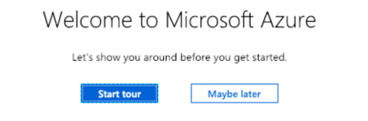
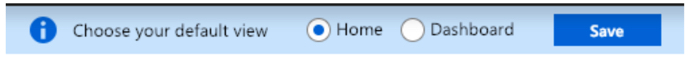

# Lab 1  - User Registration

If you don’t have an Azure account with credits please use the following registration process.

Here is the URL for the registration page. Your instructor will give you the Activation Code.
Only corporate emails can be used to register (no gmail, yahoo, outlook or hotmail).

http://bit.ly/2YLu3OG

Please complete the registration process. Then click on Launch Lab.

You will then receive an Azure Logon credentials on the email id you used for the registration. These would be the credentials that you would use for accessing the lab throughout the day. 

Login to Azure with YOUR OWN above generated credentials. You can use the copy icon to the right of the user id and password.

URL = https://azure.microsoft.com/en-us/

Click on Sign In. 

Enter the user id provided in the welcome email and the password provided from the Azure Credentials page. 

Then you will see Azure in the top right hand corner Portal. Click on Portal. 

The Azure portal will appear and you will see a welcome page for getting started.

Instead of the 'Start Tour' click on 'Maybe Later'.

You will then click on Home for the 'default' view.

### End of Lab 1
---
