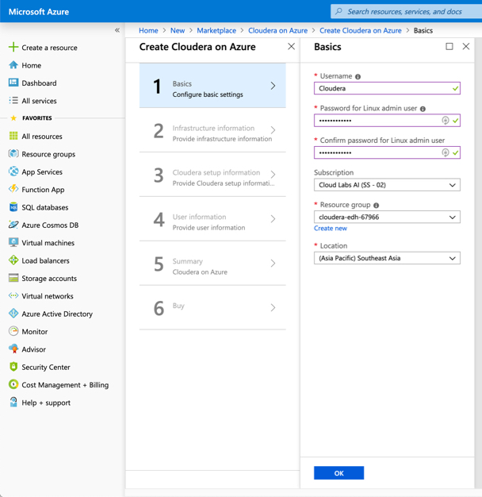
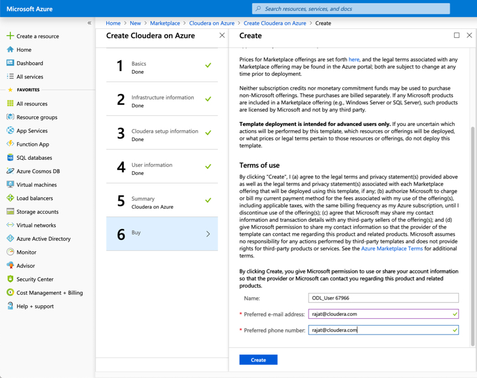

# Lab 2 - Create Cloudera Big Data Cluster on Azure

Now we will get started with the setup for Cloudera Enterprise Datahub on Azure. 

Select +Create a resource on the left hand side. We will leverage a existing image from Marketplace for this deployment. 


Search for 'Cloudera Enterprise' in Marketplace. 


Select '**Cloudera on Azure**' with the 'Cloudera Enterprise Data Hub' option.


Select Create.

Now let's go through the basic steps for setting up the various parameters and configuration options. 

### 1: Basics



* Add your User name and Password.

 User = ```Cloudera```
 Password = ```Cloudera_123```
 
* Select Subscription
 ```Cloud Labs AI (SS - 02)``` **Could be different in your case**.
 
* Select the Resource group ```cloudera-edh-67966```. 
 
* Select Location
```(Asia Pacific) Southeast Asia```

### 2: Infrastructure Information

This is an important configuration step where we would need to setup the networking, Virtual Machines that our deployment would leverage. 


The first thing to do is to change your 'Domain name prefix and cluster name'. This would also be the name of your cluster. To standardize, just keep it as the first 'five' characters of your name. 

Next we will change the storge type. By default, 'Premium LRS' is selected. We will change this to 'Locally Redundant'. 500 IOPS is sufficient for the demo and is also more cost effective. 


Next, we'll change the Virtual Machine size. By default, DS14 might be selected. Let's change it to DS13_v2. 


Next step is to create a Virtual Network. You can call it the first 5 letters of your name to keep it unique + 'Vnet'. Then subnet - your first five letters of your name + 'sub'. 


### 3: Cloudera Setup Information

In this step, we will provide the necessary inputs for the Cloudera Manager Setup, Cluster Type and number of data nodes. 


Enter Cloudera Manager User name and Password. Make sure you remember this, or select the one recommended below. 

User = ```Cloudera```
Password = ```Cloudera_123```

Select 'POC' Cluster type. Number of nodes as 3. You need a minimum of 3. This will create 4 nodes in total with a master node with suffix mn0 and 3 worker nodes with the suffix dn0, dn1 & dn2. 

### 4: User Information

Provide your user information. 


### 5: Summary

Wait for the validation to pass. 


Click OK. 

Wait for the Summary to validate and then click on OK. The next screen is for terms of use. Here you need to provide your email id, and then click on Create. 



You will then be redirected to the Azure Dashboard where Azure will create the VMs. 


Click on 'All Resources' on the left side panel and you will see your virtual machines. This could take upto 15 mins. 

You will see your virtual machines up and running once completed. 


**Open Required Inbound Ports**

Network Security Groups -NSG

Cloudera through Azure Marketplace only opens port 22 for the three created network security groups. One NSG for the subnet, one for data nodes, one for the master node.

Only default port SSH TCP/22 is opened by default.

You need to goto your security group. Let’s start with the NSG for the subnet.

Goto 'All Resources'

Select under Type –Network Security Groups


Select the first one.

You can check this by selecting the subnet.

Goto Settings.
Select Inbound Security Rules.
Click Add.
Add the following inbound security rules.


Ignore the warning messages. We would ordinarily only open the ports required.https://www.cloudera.com/documentation/enterprise/5-14-x/topics/cdh_ig_ports_cdh5.html

You need to add 3 new inbound security rules to the 3 Network Security Group. See the table below for the port numbers and protocols.


Next step select the master node NSG (network security group).

Select the one with –mn-in the name and add .
Any customer data just open all ports with the * 

Do this for -mn-and –dn-security groups created during the Azure marketplace


Make sure to add Destination port ranges = *Priority 101

Take note of all the ports that you need to  open for the key services. 

Cloudera Manager


Similarly

Cloudera Navigator: 7187
Hue: 8888

You will now have added 3 custom inbound security rules (Cloudera Manager, Cloudera Navigator, Hue) opening up all ports for each of your network security groups.


