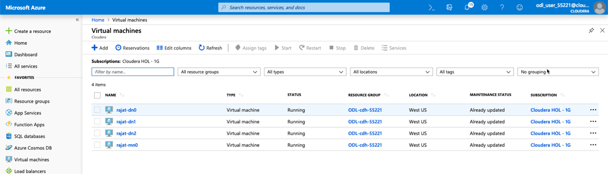
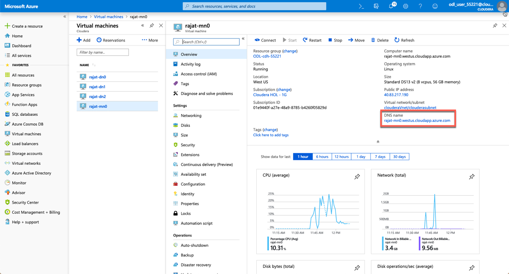
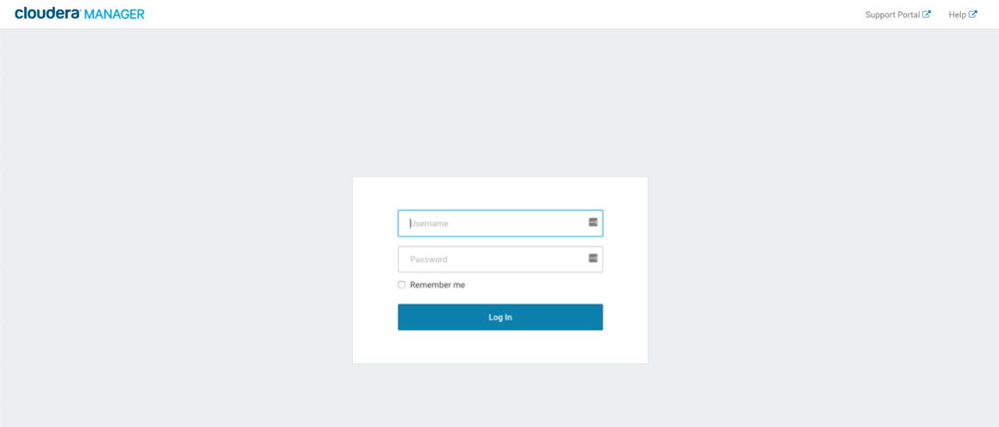
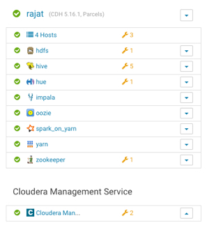
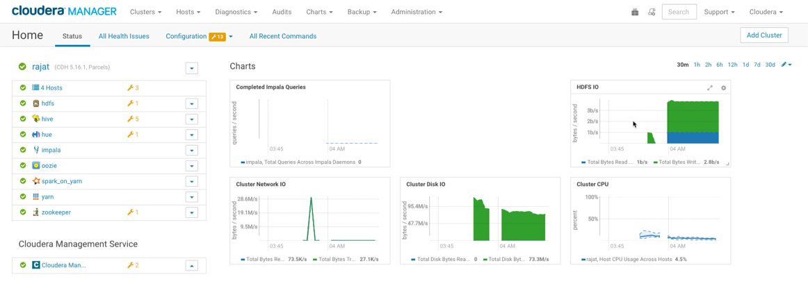
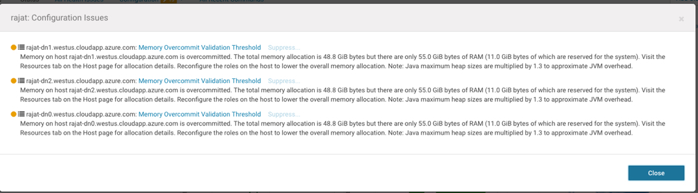
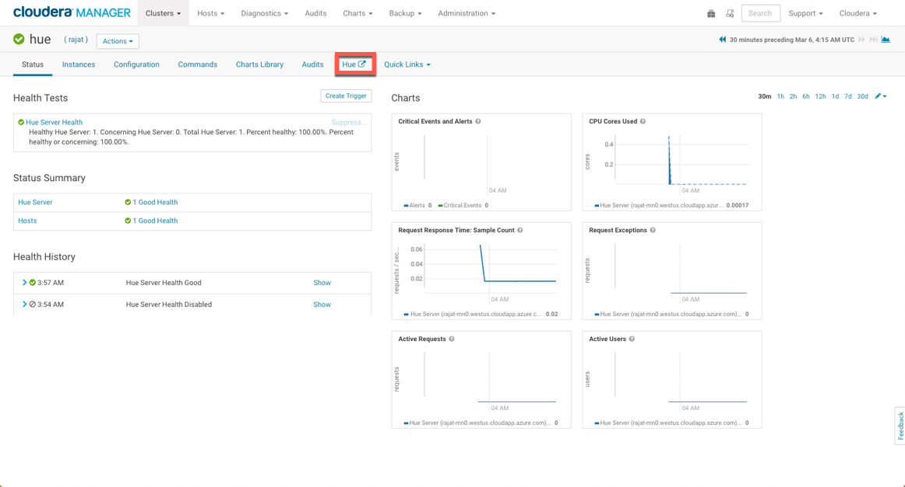
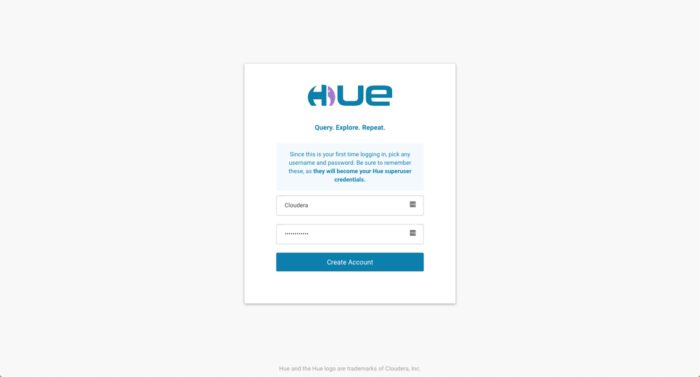

# Lab 3 - Cloudera Manager and Hue

In your Azure Dashboard on the left hand side Select Virtual machines and you should see 4 machines running.



1 master node suffix -mn0
3 worker nodes suffix -dn01,dn1,dn2

**Cloudera Manager**

Select the master node and find the computer name. 



Use the master node and the port 7180. 

For example:

http://rajat-mn0.westus.cloudapp.azure.com:7180

Bookmark this URL for later use. This URL is for Cloudera Manager.

You will then get a User logon screen. Use the Username and Password that you had entered in the 'Step 3' of the previous lab. 

User ID = ```Cloudera```
Password = ```Cloudera_123```



Post login, you should see the following dashboard:



If any of the services have a red button in front of it, it needs to be re-started. Some of the services would also show a orange alert (warning), as this is a test cluster and doesn't follow the production setup guidelines. 



On clicking these alerts, you would find more information:



These can be suppressed (for the time being) by clicking on the suppress option (next to the warning).


### Hue: Hadoop User Experince

The hue screen can be launched by clicking the link from Cloudera Manager. Click the 'Hue' service, which then takes you to the hue configuration option. There you can click on the hue link to access the Hue screen. 



**Important** Use the same User ID and password as you used to logon to Cloudera Manager.

User ID = ```Cloudera```
Password = ```Cloudera_123```



You will get a few pop-ups. Click 'Next' for all. 

### End of Lab 3
---
