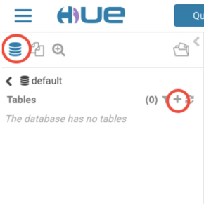
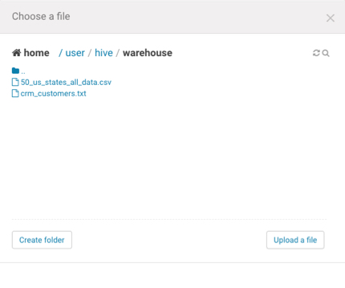
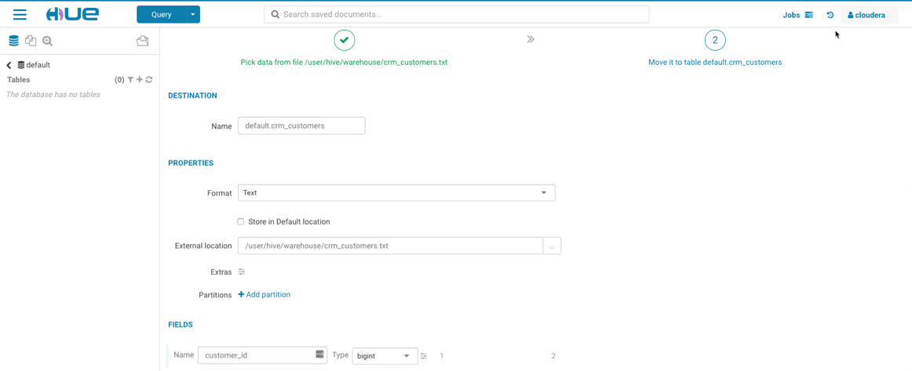
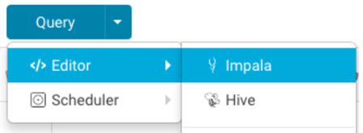
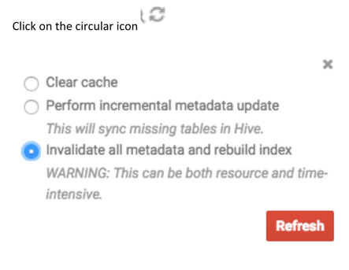
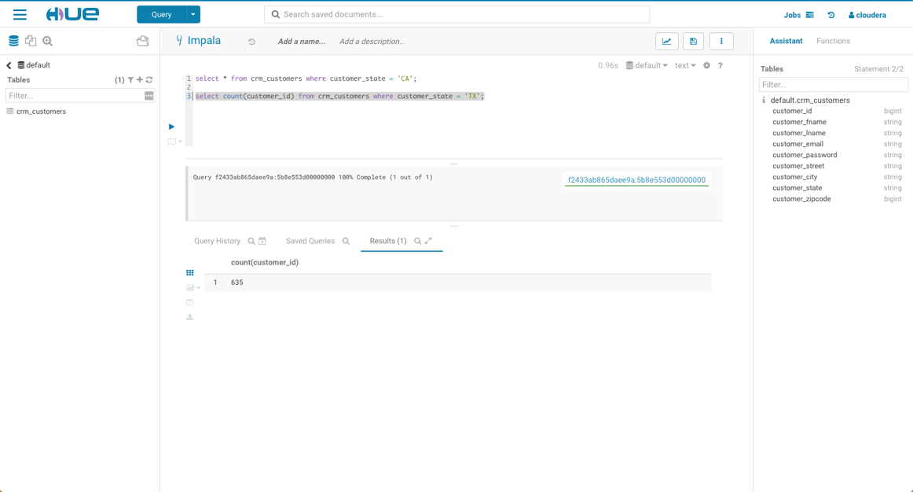
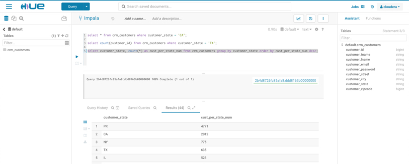
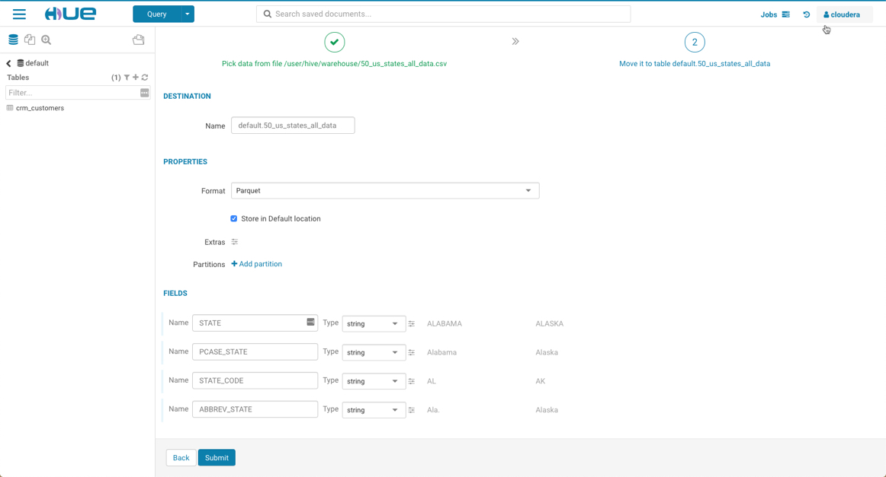
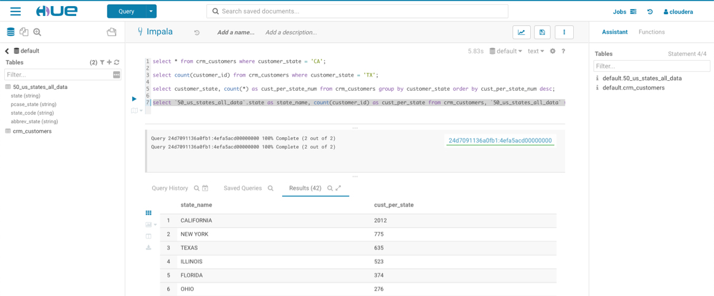

# Lab 4 - Ingestion and Analytics

There are many ways to ingest data into Hadoop. In Cloudera you can use sqoop, flume and Kafka to ingest into the Cloudera storage layers, HDFS, HBase and Kudu. You can also use HDF –Apache Nifi a fully supported Cloudera product.

You can also use the HUE web interface to ingest files and we will use this method for this lab.

If you had a database you could use Sqoop ``sqoop import-all-tables ``
	
Sqoop uses JDBC driver to extract tables from relational databases and Enterprise data warehouses into Hadoop and save those table as parquet files on HDFS.

We will use Hue to import files via the File Browser interface.

Click on DB (Blue cylindrical icon)



On the Right hand Side click the +The following screen will appear


We are going to use our CRM database table that we extracted from SalesForce. This was extracted as a tab delimited file from SFDC and we will use our Metastore manager to import this file into a HIVE table on Cloudera using HUE.

For this assignment, we will be using the file ``crm_customers.txt``. This is available in the ``labfiles`` folder. Download this to your laptop. 

When the file is downloaded, upload it to your Cloudera instance, using the wizard we have started earlier.Then Import to Table.

Select the file that you downloaded earlier.



Store it in ``/user/hive/warehouse``

Check Has Header.
Click on Next.



**Important: Make sure to ‘uncheck’ the Store in Default location and click on Submit**. You can ignore a potential warning on the right top corner of your screen. Your new table ``crm_customers`` will appear on the left hand pane. 

### Using Impala

Click on the Query Menu and Select Impala.



Click on the circular icon. 



Select ``Invalidate all metadata`` and rebuild index and select Refresh button. 
Go into the Query windows and do two queries:

* Select all customers from California
		```select * from crm_customers 
		where customer_state = 'CA';```
* Count up the number of customers in Texas
		```select count(customer_id) from crm_customers where customer_state = 'TX';```
		


Challenge -write a SQL script to group the customers by state and count how many customers in each state and order by descending (largest number of customers per state first).

Can you name the top 3 states?

		select customer_state, count(*) as cust_per_state_num from crm_customers group by customer_state order by cust_per_state_num desc



Now add in the state name from a list from the internet. The file can be downloaded from: https://scottontechnology.com/list-of-50-us-states-in-excel

This file is also available in ``labfiles`` folder. Upload this file in the /user/hive/warehouse folder.

select the one with ``50_us_states_all_data.csv`` And list them out as customer state.

**Tip:** use  HUE –add the table as parquet. Remember to keep the option of 'Store in default location' selected this time. Then go back to HUE -> Query and hit refresh metadata.



Add the names of the fields as follows:

* STATE
* PCASE_STATE
* STATE_CODE
* ABBREV_STATE

		select `50_us_states_all_data`.state as state_name, count(customer_id) as cust_per_state from crm_customers, 
		`50_us_states_all_data` where crm_customers.customer_state = 50_us_states_all_data.`state_code` 
		group by state_name order by cust_per_state desc;



### End of Lab 4
---


