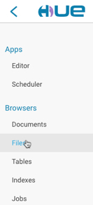
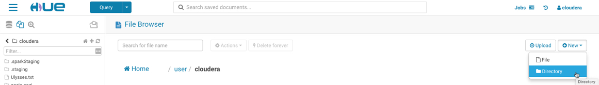
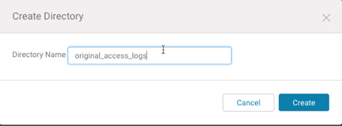
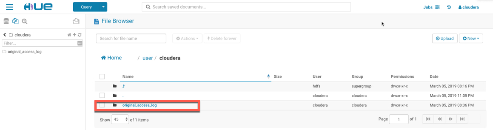
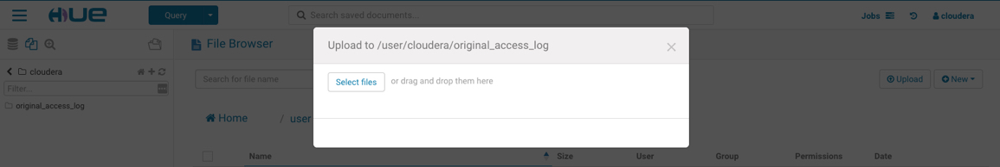
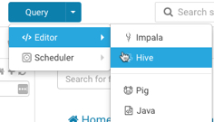
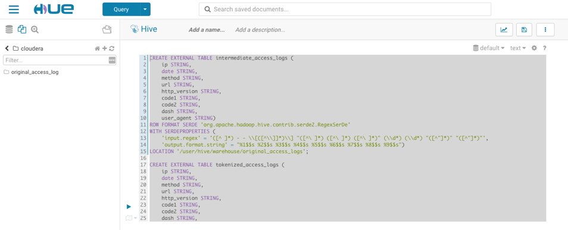
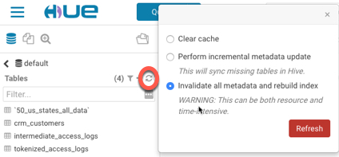
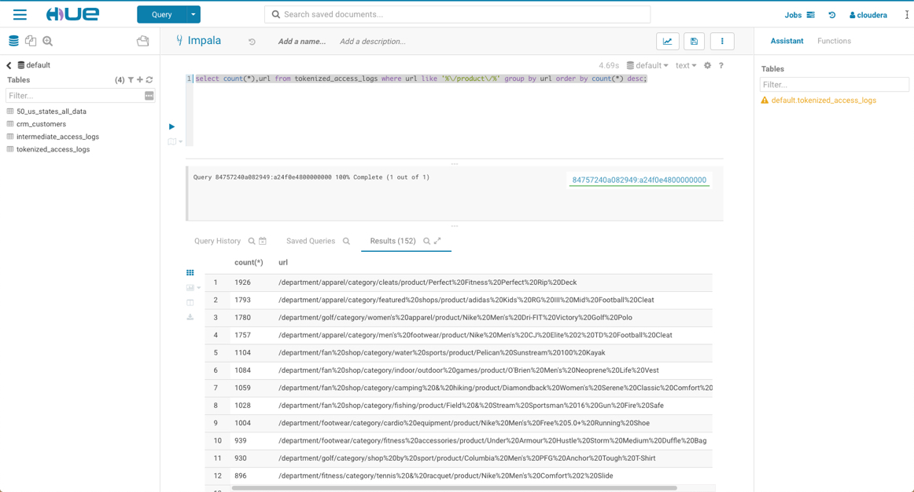
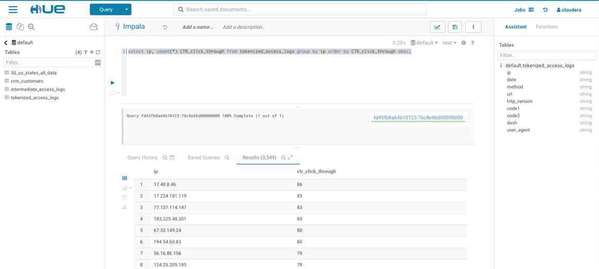

# Lab 5 – HIVE and Impala analytics for Web Logs

Hadoop can store unstructured and semi-structured data alongside structured data without remodelling an entire database, you can ingest, store, parse and process web log events. Let's find out what our online customers have clicked through on using our web logs and further analytics.

For this, you need the web clickstream data. We prepared a web clickstream data set that you can bulk upload into HDFS directly.

Go into Hue, and on the menu in the left hand corner a drop down appears

Select Files 

For this lab, we will be using the file **web.log.2**. Download this from the ``labfiles`` folder.

You would then need to create a directory - ``original_access_logs``. Do this by selecting **New -> Directory**

Navigate into the ``original_access_logs`` directory. 

Select the Upload Button, and upload the downloaded file web.log.2 to your Cloudera hdfs directory.

Now you can build a table in Hive and query the data via Impala and Hue. You'll build this table in 2 steps. First, you'll take advantage of Hive's flexible SerDe (serializers / deserializers) to parse the logs into individual fields using a regular expression. Second, you'll transfer the data from this intermediate table to one that does not require any special SerDe. Once the data is in this table, you can query it much faster and more interactively using Impala.

We'll use the Hive Query Editor app in Hue to execute the following queries this is because we need to use the SerDewhich is available in HIVE.

Let's open the Hive Query Editor. 

Copy and paste the follow text into the HIVE Editor.

	CREATE EXTERNAL TABLE intermediate_access_logs (
	    ip STRING,
	    date STRING,
	    method STRING,
	    url STRING,
	    http_version STRING,
	    code1 STRING,
	    code2 STRING,
	    dash STRING,
	    user_agent STRING)
	ROW FORMAT SERDE 'org.apache.hadoop.hive.contrib.serde2.RegexSerDe'
	WITH SERDEPROPERTIES (
	    'input.regex' = '([^ ]*) - - \\[([^\\]]*)\\] "([^\ ]*) ([^\ ]*) ([^\ ]*)" (\\d*) (\\d*) "([^"]*)" "([^"]*)"',
	    'output.format.string' = "%1$$s %2$$s %3$$s %4$$s %5$$s %6$$s %7$$s %8$$s %9$$s")
	LOCATION '/user/cloudera/original_access_logs';
	
	CREATE EXTERNAL TABLE tokenized_access_logs (
	    ip STRING,
	    date STRING,
	    method STRING,
	    url STRING,
	    http_version STRING,
	    code1 STRING,
	    code2 STRING,
	    dash STRING,
	    user_agent STRING)
	ROW FORMAT DELIMITED FIELDS TERMINATED BY ','
	LOCATION '/user/cloudera/tokenized_access_logs';
	
	ADD JAR /opt/cloudera/parcels/CDH/lib/hive/lib/hive-contrib.jar;
	

Select the full text and click in the run button on the left hand side. This should automatically create two new tables ``intermediate_access_logs`` and ``tokenized_access_logs``.

we need to tell Impala that some tables have been created through a different tool. Switch back to the Impala Query Editor app, and click refresh.

This can also be done by executing ``invalidate metadata;`` in the Impala Query Editor. 

Now, if you enter the 'show tables;' query or refresh the table list in the left-hand column, you should see the two new external tables in the default database. Paste the following query into the Query Editor:

	select count(*),url from tokenized_access_logs
	where url like '%\/product\/%'
	group by url order by count(*) desc;

This lists in Ascending order the most popular request by product:
* Perfect Fitness Perfect 20 Rip
* Adidas Kids Mid Football Cleat 
* Victory Golf Polo...

As our Top 3 click through items on our retail website.

Now we will do further analysis –lets try and find out which customer and which IP address had the most click throughs.Can you pick the IP address that have the highest number of Click Through Rates.Try and create a SQL Query to write this:

	select ip, count(*) CTR_click_through 
	from tokenized_access_logs 
	group by ip 
	order by CTR_click_through desc;

``17.40.8.46`` has ``86`` click throughs on this click stream, then ``17.224.101.119`` has ``83``. 

We can do further analysis on where these IP address Geolocation using a pySpark job and finding out which states have the highest number of click throughs on our retail website. We could even tie IP address to customer based on customer login details andcreate a Customer 360 of our retail customer profile and shopping habits.

