### Lab 6 - Running Spark on Cloudera

Apache Spark is a fast and general engine for large-scale data processing. It is written in Scala and is a functional programming language that runs in a JVM. It supports 3 languages: Scala, Python and Java. With Cloudera you get the Spark-shell either forPython or for Scala. Cloudera also uses Spark for Data Science and we have Cloudera Data Science Workbench that supports the 3 major Data Scientist languages –R using Sparklyr, Python using pySpark (2 and 3) and Scala for ETL.

You can use Spark for general purpose ETL, large scale data processing, Machine learning, SQL using SparkSQL and for Spark Streaming. Application developers are also using Spark to build out Big Data applications. Cloudera supports both Spark 1.6 and Spark 2.3 R4 in CDH 5.16.1 and you can run Spark 2.x as a separate service to Spark 1.6 to allow you run newer Spark 2.0 code and legacy Spark 1.6. https://www.cloudera.com/downloads/spark2/2-3-r4.html

First let'simport a file using the File Browser on Hue
* Login to Hue
* Select File Browser

In this lab we are going to download the full text of James Joyce Nobel prize winning Ulysses book a book written in day in the life of Leopold Bloom as he wanders the streets of Dublin. We are then going to count up the number of words that are used and group them into an set of output files counting the number of unusual words that James Joyce used to describe Leopold Bloom’s day in Dublin.

Download the following file **Ulysses.txt** to your laptop and upload it to ``/user/cloudera`` 

What we are going to do is to a word count on the full text of Ulysses Upload the file to ``/user/cloudera``

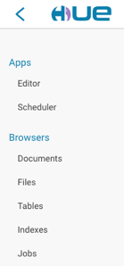

Make sure you are in ``/user/cloudera`` directory

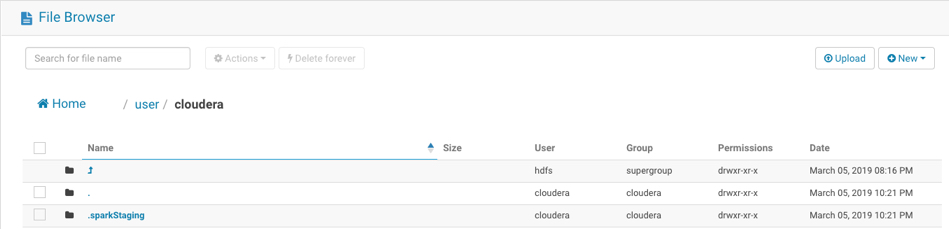

You can view the text of the document, by clicking on the filename.

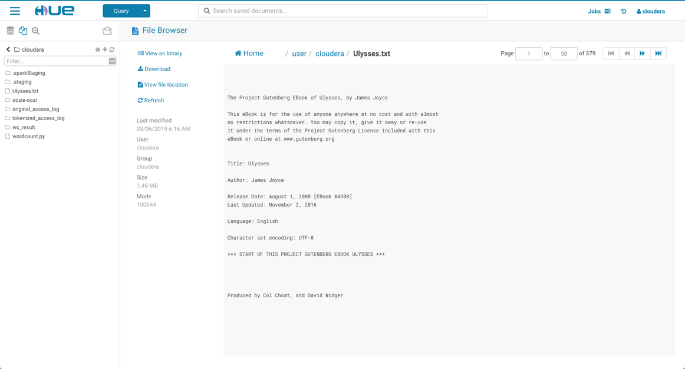

We are going to write a small PySpark program, that will take the ulysses.txt document as an input, and will do a word count on the whole document.  Hit the ‘New’ button on the right top of the screen, and then select ‘file’.

Give the file a name, that ends with .py like wordcount.py.

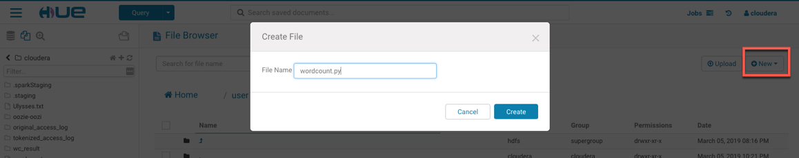

When the file is created, click on the file to view it, it is empty. Hit the ‘Edit File’ button to write the PySpark program. Add the following lines of code to the wordcount.py program. 

#### PySpark Program

	# # Word counts 
	# # This example shows how to count the occurrences of each word in a text file. 
	
	import sys, re 
	from operator import add 
	from pyspark import SparkContext 
	
	sc = SparkContext(appName="Wordcount") 
	text_file = sc.textFile("/user/cloudera/Ulysses.txt") 
	counts = text_file.flatMap(lambda line: line.split(" ")) \
	 .map(lambda word: (word.lower(), 1)) \
	 .reduceByKey(lambda a, b: a + b) 
	
	counts.saveAsTextFile("/user/cloudera/wc_result") 
	sc.stop()
	
As soon as you all your lines of code are ready, hit the ‘Save’ button.

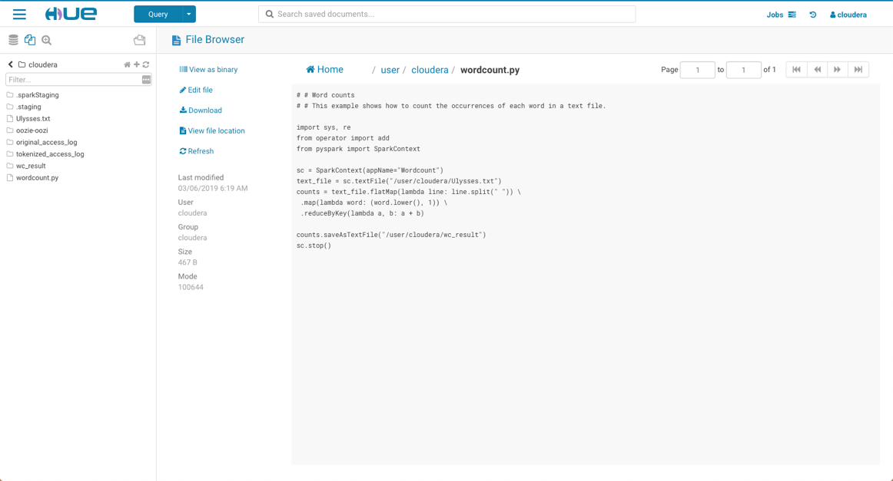

Then go to Spark query editor

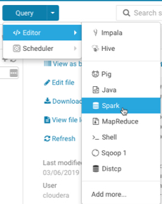

You are now in the Spark Query library
Click New under the : (3 dots)

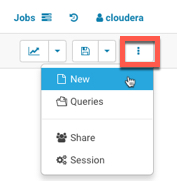

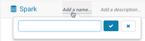

* Name = PySpark_WordCount
* Description = Python Script to count the number of words in a file
* Click Libs and select the file wordcount.py
* Click Save

Click on the play icon on the left and the program will execute. 

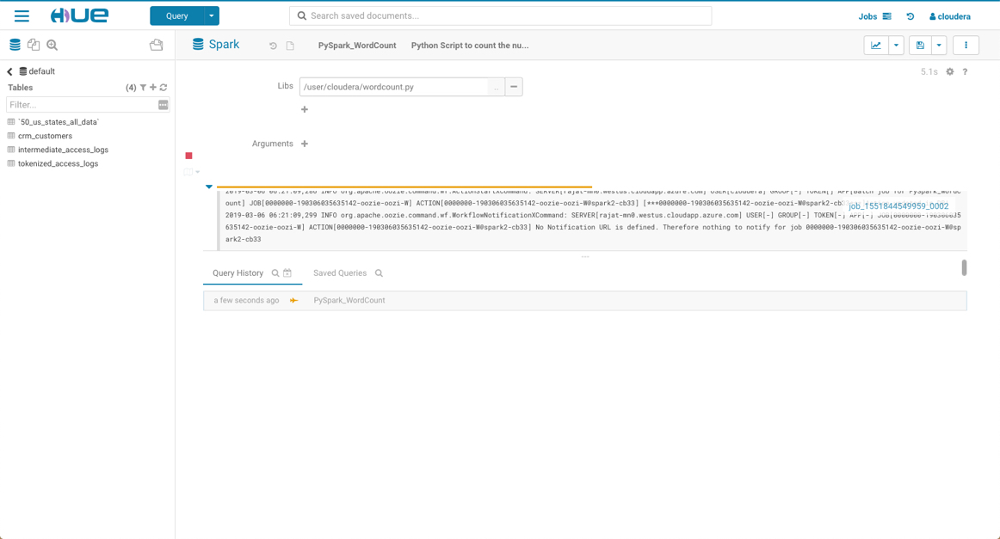

The stdout will appear in the Results tab belowYou should get 475 lines

Check resultsThe result of the wordcount.py program is written to a directory ``/user/cloudera/wc_results`` directory. Let’s use the File Browser in Hue to navigate to that directory and check the results.From Hue, select the File Browser tool. 

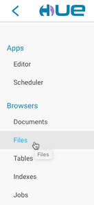

Navigate to your ``/user/cloudera/wc_result`` directory.

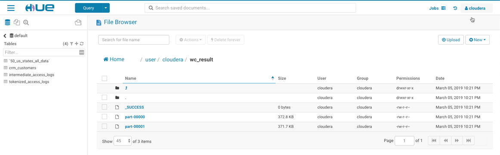

If your workflow completed successfully, you should see a file ``_SUCCESS``, and 2 or more files called ``part-0000X``. That is normal behaviour in hdfs. All part files together represent the whole file. The different parts are processed by different engines. That allows to run many things in parallel. You can view the parts by selecting it. You should see something like this:

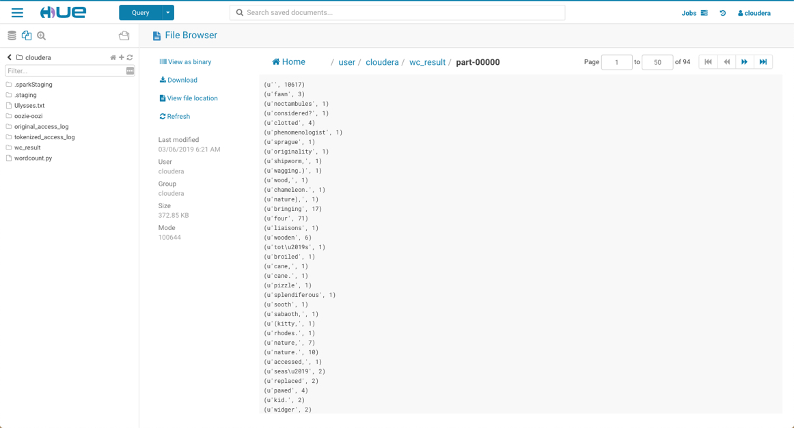

Some very interesting words were used in Ulysses –pawed, phenomenologist, Sprague, noctambulesWe could also look at writing a machine learning model to classify streams of text using pySpark but that is also for another day.
